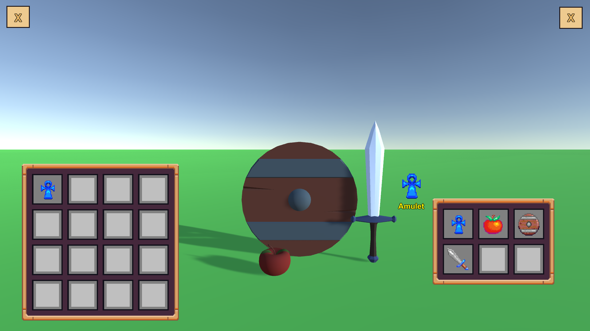

# InventorySystem

This is an inventory system prototype I wrote to rehash the topic.

I tried to make it compact, although there's still many things I'd like to work on.

## Features

- Scriptable Objects used for item data
    - Stores information about:
        - Name
        - Type
        - Value
        - Icon
        - 3D World-item representation

- Visual inventory representation
    - Resizes based on the slot count
    - Automatically created slots

- Drag and drop system
    - World to inventory drag
    - Inventory to world drag
    - Inventory to inventory drag

- Resize inventory
    - Compact items to first slots
    - Drop out items that don't fit in